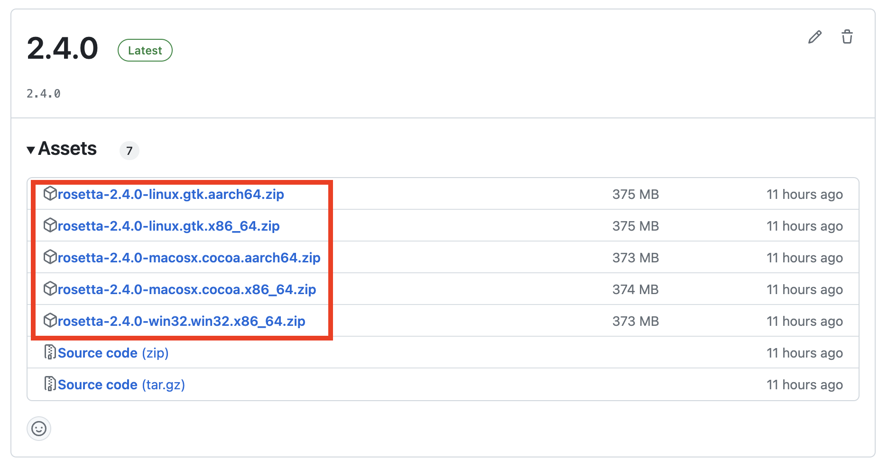
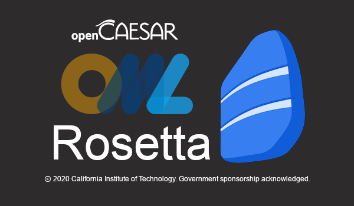
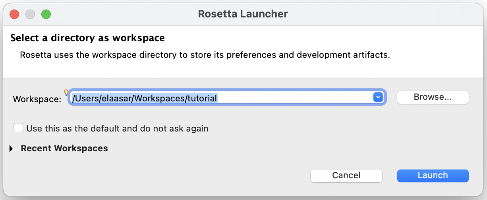
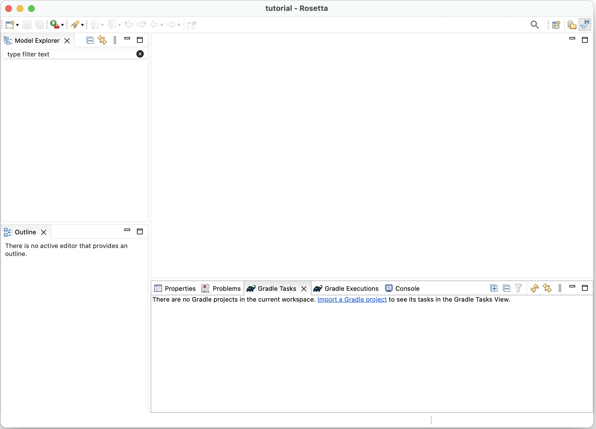

[← Voltar ao índice](../README.md#índice)

# Preparação do ambiente e do Rosetta

Esta seção prepara o ambiente (Rosetta e workspace) para os tutoriais de OML. Se você já tem o OML Rosetta instalado e um workspace configurado, pode ir direto para o **Tutorial 1 – OML Basics (CTI)**.

## Instalar o OML Rosetta

1. Acesse a página de releases do OML Rosetta:  
   https://github.com/opencaesar/oml-rosetta/releases/latest
2. Baixe o arquivo compactado correspondente ao seu sistema operacional (Windows, macOS ou Linux).
3. Descompacte o arquivo `.zip` ou `.tar` em uma pasta de sua preferência. Isso criará o aplicativo `Rosetta.app` (macOS) ou o executável equivalente no seu sistema.



### Passo extra para macOS

No macOS, se ao abrir o Rosetta aparecer um aviso de aplicativo não verificado, execute no terminal:

```bash
xattr -cr <path/to/Rosetta.app>
```

Exemplo:

```bash
xattr -cr ~/Applications/Rosetta.app
```

Depois disso, tente abrir o Rosetta novamente.

---

## Executar o Rosetta e configurar o workspace

1. Navegue até o aplicativo.
2. Clique duas vezes para abrir.

Ao abrir, você deverá ver a tela inicial (splash) do Rosetta:



---

### Criar o workspace

Ao iniciar o Rosetta, será solicitado um *workspace*.

1. Crie uma nova pasta no seu sistema, por exemplo:

   ```bash
   mkdir -p ~/workspace-oml
   ```

2. Este diretório armazenará:
   - projetos OML
   - arquivos de ontologia
   - resultados de *build*
   - consultas SPARQL

Na primeira execução, o Rosetta solicitará a escolha de um workspace, como mostrado abaixo:



---

### Abrir a *Modeling Perspective*

Após abrir o Rosetta:

1. Mude para a **Modeling Perspective**.  
   Essa perspectiva inclui painéis específicos para modelagem ontológica.

O processo de troca para a *Modeling Perspective* é ilustrado no vídeo a seguir:

<video src="videos/4-switch-to-modeling-perspective.mov" controls width="640"></video>

Baixar vídeo: [4-switch-to-modeling-perspective.mov](videos/4-switch-to-modeling-perspective.mov)

---

### Conhecer a interface principal

A interface inclui os seguintes componentes:

- **Model Explorer** – mostra a estrutura de arquivos do projeto.
- **Editors** – área onde os arquivos OML são editados.
- **Outline** – mostra a estrutura do arquivo atual.
- **Problems** – exibe erros e avisos do modelo.
- **Gradle Tasks** – lista de tarefas Gradle disponíveis.
- **Gradle Executions** – mostra execuções de tarefas.
- **Console** – exibe logs e mensagens de execução.
- **Properties** – mostra propriedades do elemento selecionado.

A figura abaixo mostra a *Modeling Perspective* configurada com todos esses componentes:



Os vídeos a seguir demonstram mais detalhes da interface:

- Mostrar/abrir diferentes *views* do ambiente:  
  <video src="videos/5-show-views.mov" controls width="640"></video>

   Baixar vídeo: [5-show-views.mov](videos/5-show-views.mov)
- Habilitar numeração de linhas nos editores:  
  <video src="videos/7-enable-line-numbers.mov" controls width="640"></video>

   Baixar vídeo: [7-enable-line-numbers.mov](videos/7-enable-line-numbers.mov)

---

[Voltar ao índice](../README.md#índice)
