[← Voltar ao índice](../README.md#índice)

# Tutorial 1 – OML Basics (CTI)

### 1.1. Objetivos de aprendizagem

Ao final deste tutorial, você será capaz de:

- criar um projeto OML no Rosetta para a ontologia de CT&I;
- definir um vocabulário OML (`cti`) com conceitos, relações e propriedades escalares do domínio de CT&I;
- criar uma description (`cti-pe`) que instancia o vocabulário com dados de exemplo de programas, instituições, pessoas e produções científicas;
- configurar vocabulary e description bundles para habilitar raciocínio em mundo fechado sobre o dataset de CT&I;
- executar o *build* Gradle (`cti/build/build`) para verificar a consistência lógica do modelo;
- criar e organizar consultas SPARQL em `src/sparql`;
- executar consultas SPARQL via tarefas Gradle (`startFuseki` e `owlQuery`) e inspecionar os resultados em JSON gerados em `build/results`.

### 1.2. Criar o projeto OML de CT&I

Nesta etapa vamos criar, no Rosetta, um projeto OML chamado `cti` que servirá como container Gradle para o vocabulário e demais artefatos da ontologia.

1. No Rosetta, na *Model Explorer*, clique com o botão direito em uma área vazia e selecione **New → OML Project**.
2. No campo **Project name**, digite `cti` e avance (**Next**).
3. Preencha os campos principais seguindo o mesmo padrão do Tutorial 1 oficial (apenas adaptando para CT&I):
   - **Base IRI**: `http://gic.ufrpe.br/cti`
   - **Bundle Kind**: `Description`
   - **Bundle Namespace**: `http://gic.ufrpe.br/cti/description/bundle#`
   - **Title**: `CTI`
   - **Description**: `Ontologia de Ciência, Tecnologia e Inovação`
4. Clique em **Finish** e aguarde a criação do projeto.

A tela de criação do projeto deve ficar semelhante à figura abaixo:

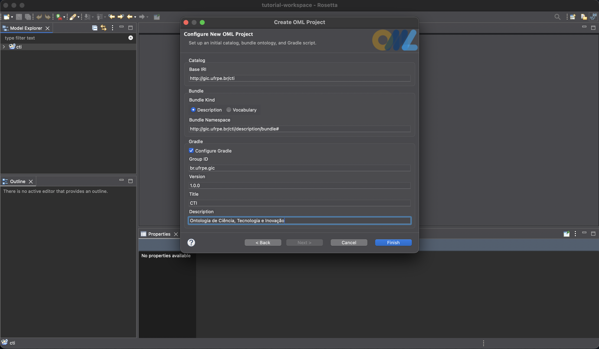

Após alguns segundos, o projeto `cti` deve aparecer na *Model Explorer*, com a pasta `src/oml` e um arquivo `bundle.oml` inicial.

A estrutura expandida do projeto no *Model Explorer* deve se parecer com o seguinte:

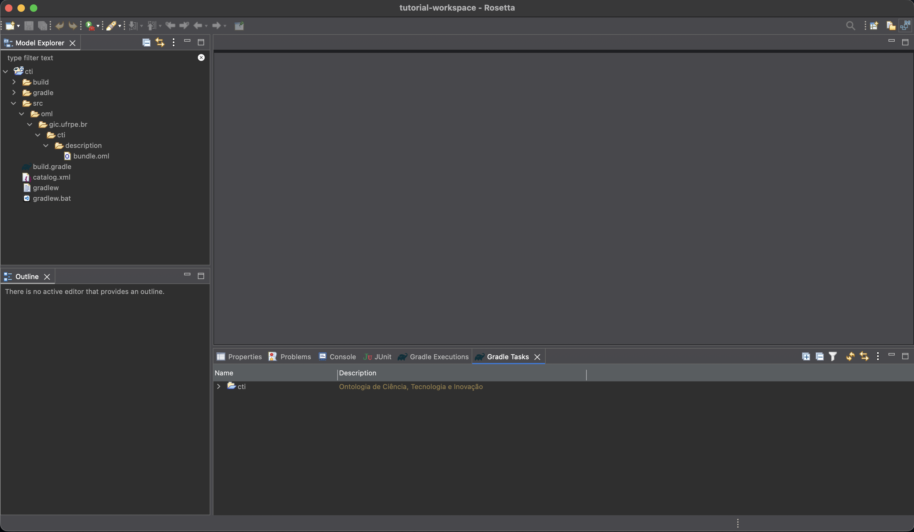

### 1.3. Criar o vocabulário CTI

Agora vamos criar o vocabulário que descreve os principais conceitos de CT&I.

1. No projeto `cti`, navegue até a pasta `src/oml` na *Model Explorer*.
2. Repare que o assistente já criou a pasta `gic.ufrpe.br/cti/description` automaticamente (de acordo com a **Base IRI** e o **Bundle Namespace** definidos no passo 1.2).
   - Dentro de `src/oml/gic.ufrpe.br`, crie **apenas** uma nova pasta chamada `vocabulary` (clique com o botão direito em `gic.ufrpe.br` → **New → Folder** → `vocabulary`).
3. Clique com o botão direito em `src/oml/gic.ufrpe.br/vocabulary` e selecione **New → OML Model**.
4. Preencha o formulário do modelo OML com os seguintes valores:
   - **Ontology Kind**: `Vocabulary`
   - **Namespace**: `http://gic.ufrpe.br/cti/vocabulary/cti#`
   - **Prefix**: `cti`
5. Clique em **Finish**. Será criado o arquivo `cti.oml` e aberto o editor textual.

A tela de criação do vocabulário CTI no assistente deve ser semelhante à figura abaixo:

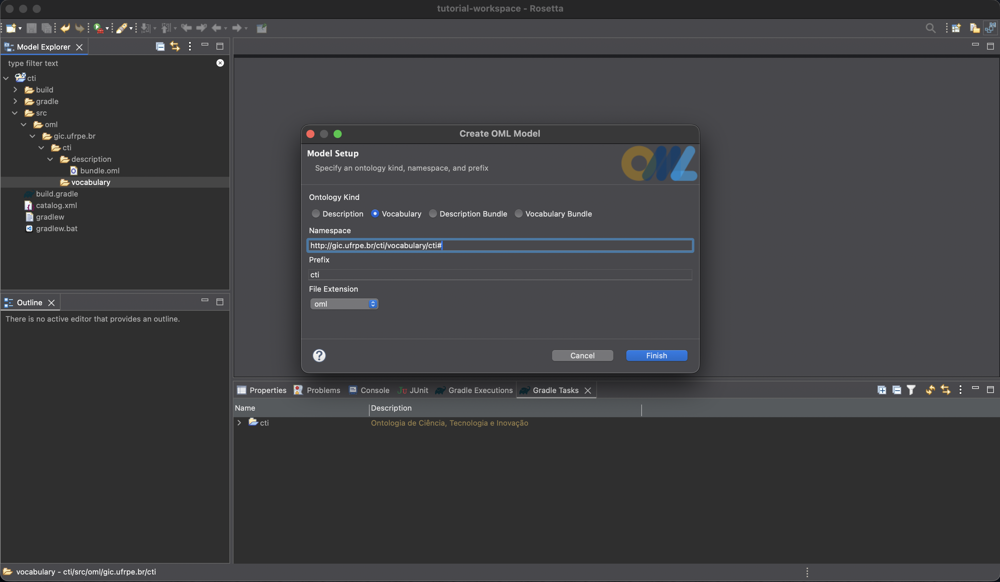

No editor de `cti.oml`, você pode agora definir os conceitos principais da ontologia de CT&I. Para seguir, você pode copiar o conteúdo completo abaixo:

```oml
vocabulary <http://gic.ufrpe.br/cti/vocabulary/cti#> as cti {

	extends <http://www.w3.org/2001/XMLSchema#> as xsd

	concept PPG

	concept ICT

	concept Conceito_PPG

	relation sediado [
		from PPG
		to ICT
	]

	relation avaliado [
		from PPG
		to Conceito_PPG
	]

	concept Discente < Pessoa

	concept Docente < Pessoa

	relation vinculado [
		from Discente
		to PPG
	]

	relation membro [
		from Docente
		to PPG
	]

	aspect Pessoa

	scalar property an_base_conceito [
		domain Conceito_PPG
		range xsd:integer
	]

	scalar property cd_conceito_programa [
		domain Conceito_PPG
		range xsd:string
	]

	scalar property cd_entidade_capes [
		domain ICT
		range xsd:string
	]

	scalar property sg_entidade_ensino [
		domain ICT
		range xsd:string
	]

	scalar property nm_entidade_ensino [
		domain ICT
		range xsd:string
	]

	scalar property sg_uf [
		domain ICT
		range xsd:string
	]

	scalar property cd_programa_ies [
		domain PPG
		range xsd:string
	]

	scalar property nm_programa_ies [
		domain PPG
		range xsd:string
	]

	scalar property nm_modalidade_programa [
		domain PPG
		range xsd:string
	]

	scalar property nm_area_conhecimento [
		domain PPG
		range xsd:string
	]

	scalar property id_pessoa [
		domain Pessoa
		range xsd:integer
	]

	scalar property nr_documento [
		domain Pessoa
		range xsd:string
	]

	scalar property nm_pessoa [
		domain Pessoa
		range xsd:string
	]

	scalar property an_nascimento [
		domain Pessoa
		range xsd:integer
	]

	scalar property nm_pais_nacionalidade [
		domain Pessoa
		range xsd:string
	]

	scalar property ds_url_cv_lattes [
		domain Pessoa
		range xsd:string
	]

	scalar property ds_grau_academico_discente [
		domain Discente
		range xsd:string
	]

	scalar property nm_situacao_discente [
		domain Discente
		range xsd:string
	]

	scalar property qt_mes_titulacao [
		domain Discente
		range xsd:int
	]

	scalar property ds_categoria_docente [
		domain Docente
		range xsd:int
	]

	scalar property ds_tipo_vinculo_docente_ies [
		domain Docente
		range xsd:string
	]

	scalar property ds_regime_trabalho [
		domain Docente
		range xsd:string
	]

	scalar property cd_cat_bolsa_produtividade [
		domain Docente
		range xsd:string
	]

	scalar property an_titulacao [
		domain Docente
		range xsd:int
	]

	scalar property nm_grau_titulacao [
		domain Docente
		range xsd:string
	]

	concept Autor < Pessoa

	scalar property ds_orc_id [
		domain Autor
		range xsd:string
	]

	scalar property ds_scopus_id [
		domain Autor
		range xsd:string
	]

	scalar property ds_url_google_scholar [
		domain Autor
		range xsd:string
	]

	concept Producao_Cientifica

	scalar property an_base_producao [
		domain Producao_Cientifica
		range xsd:integer
	]

	scalar property ds_natureza [
		domain Producao_Cientifica
		range xsd:string
	]

	scalar property nm_titulo [
		domain Producao_Cientifica
		range xsd:string
	]

	scalar property ds_url_acesso [
		domain Producao_Cientifica
		range xsd:string
	]

	scalar property ds_palavras_chave [
		domain Producao_Cientifica
		range xsd:string
	]

	scalar property ds_doi [
		domain Producao_Cientifica
		range xsd:string
	]

	scalar property nr_citacoes_publicacao [
		domain Producao_Cientifica
		range xsd:string
	]

	relation autoria [
		from Autor
		to Producao_Cientifica
	]

	concept Veiculo_Publicacao

	scalar property nm_veiculo_publicacao [
		domain Veiculo_Publicacao
		range xsd:string
	]

	scalar property ds_isbn_issn [
		domain Veiculo_Publicacao
		range xsd:string
	]

	scalar property nr_citescore_scopus [
		domain Veiculo_Publicacao
		range xsd:int
	]
	
	scalar property nr_quartil_scopus [
		domain Veiculo_Publicacao
		range xsd:int
	]

	relation publicada [
		from Producao_Cientifica
		to Veiculo_Publicacao
	]

	concept Citacao

	scalar property an_base_citacao [
		domain Citacao
		range xsd:integer
	]

	scalar property nr_indice_h [
		domain Citacao
		range xsd:int
	]

	scalar property nr_indice_i10 [
		domain Citacao
		range xsd:int
	]

	scalar property nr_citacoes_autor [
		domain Citacao
		range xsd:integer
	]

	relation mensurado [
		from Autor
		to Citacao
	]

	relation orientador [
		from Discente
		to Docente
	]
}
```

Salve o arquivo (`Ctrl+S` ou `Cmd+S`). O Rosetta deve atualizar o *Outline* mostrando a estrutura do vocabulário.

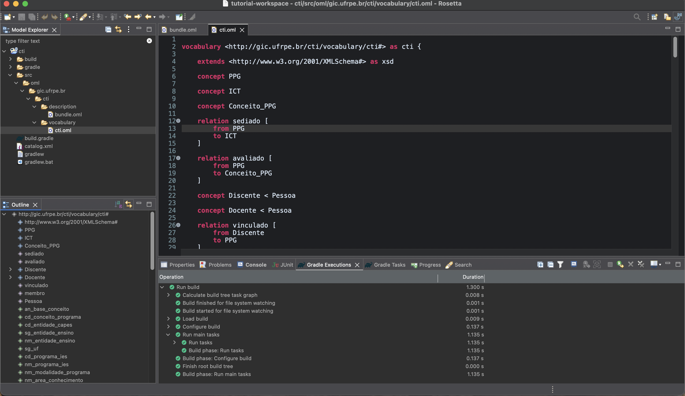

### 1.4. Criar o Vocabulary Bundle de CT&I

Agora vamos criar um **vocabulary bundle** para o vocabulário de CT&I. Esse bundle será o ponto de entrada para raciocínio em **mundo fechado** sobre os conceitos definidos em `cti.oml`.

1. Na *Model Explorer*, clique com o botão direito na pasta `src/oml/gic.ufrpe.br/vocabulary` e selecione **New → OML Model**.
2. Preencha os campos do novo modelo conforme abaixo e clique em **Finish**:
   - **Ontology Kind**: `Vocabulary Bundle`
   - **Namespace**: `http://gic.ufrpe.br/cti/vocabulary/bundle#`
   - **Prefix**: `bundle` (ou deixe o padrão que o assistente sugerir)

A figura a seguir ilustra o preenchimento do formulário no Rosetta:

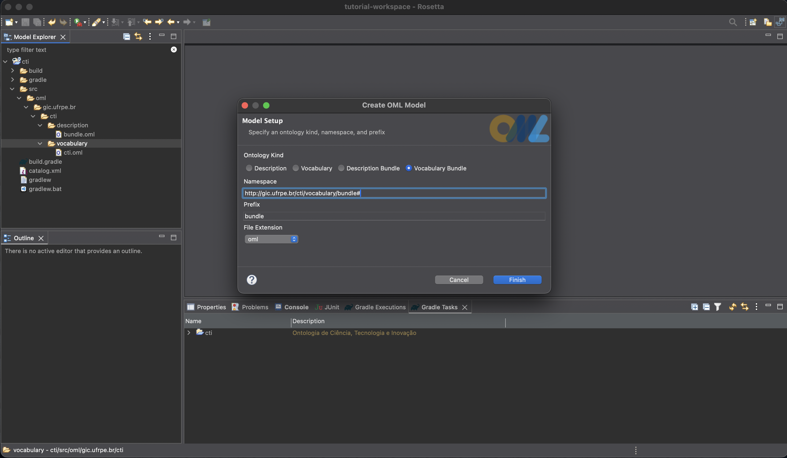

O arquivo `src/oml/gic.ufrpe.br/vocabulary/bundle.oml` será criado e aberto no editor. Substitua o conteúdo pelo código abaixo:

```oml
vocabulary bundle <http://gic.ufrpe.br/cti/vocabulary/bundle#> as ^bundle {

	// O vocabulary bundle "inclui" o vocabulário CTI
	includes <http://gic.ufrpe.br/cti/vocabulary/cti#>

}
```

Depois de salvar, o editor deve ficar semelhante à figura a seguir:

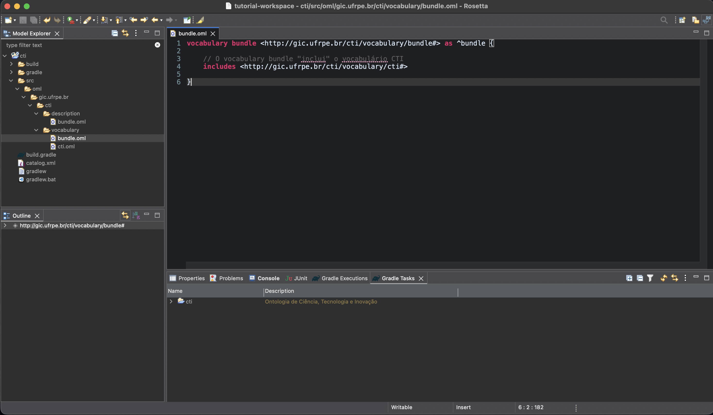

Esse vocabulary bundle será usado mais à frente pelo description bundle para herdar os axiomas de fechamento de mundo sobre as classes de CT&I.

### 1.5. Criar uma Description de CT&I (CTI-PE)

Nesta etapa vamos criar uma **description** que instancia o vocabulário de CT&I com alguns dados de exemplo — por exemplo, um PPG em CT&I em Pernambuco, sua instituição, conceito CAPES e alguns atores e produções.

1. Na *Model Explorer*, localize a pasta `src/oml/gic.ufrpe.br/description`.
   - Essa pasta foi criada automaticamente pelo assistente de projeto, de acordo com a **Base IRI** e o **Bundle Namespace** definidos no passo 1.2.
2. Clique com o botão direito em `description` e selecione **New → OML Model**.
3. Preencha o formulário com os valores a seguir e clique em **Finish**:
   - **Ontology Kind**: `Description`
   - **Namespace**: `http://gic.ufrpe.br/cti/description/cti-pe#`
   - **Prefix**: `cti-pe`

A tela do assistente para criação da description CTI-PE deve se parecer com a figura abaixo:

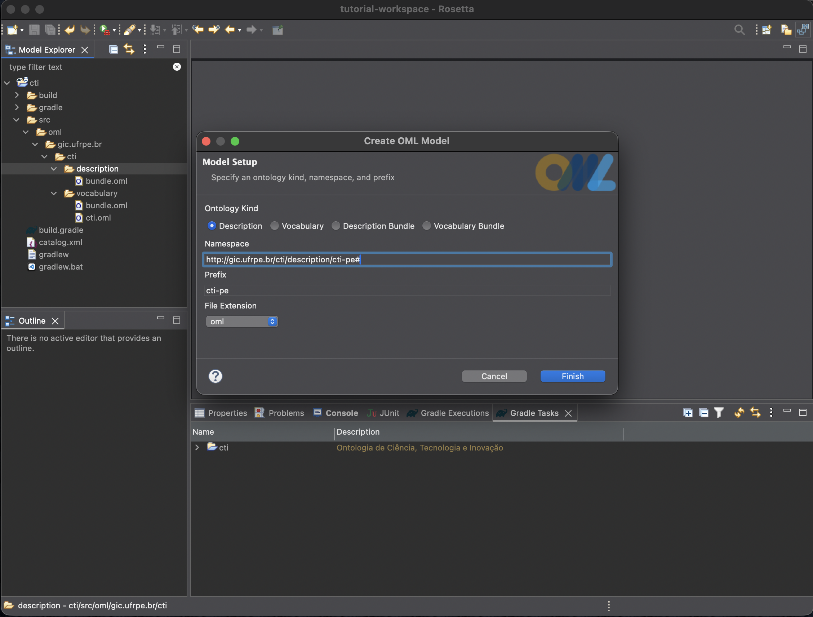

O arquivo `src/oml/gic.ufrpe.br/description/cti-pe.oml` será criado e aberto. Substitua o conteúdo pelo código abaixo (você pode adaptar os valores conforme seu contexto, se desejar):

```oml
@dc:description "Descrição de alguns elementos de CT&I em Pernambuco"
description <http://gic.ufrpe.br/cti/description/cti-pe#> as cti-pe {

	uses <http://purl.org/dc/elements/1.1/> as dc

	// Vocabulário principal de CT&I
	uses <http://gic.ufrpe.br/cti/vocabulary/cti#> as cti

	// ---------------------------------------------------------------------
	// Instituições de Ciência e Tecnologia (ICT)
	// ---------------------------------------------------------------------

	instance ict-ufrpe : cti:ICT [
		cti:cd_entidade_capes "23004"
		cti:sg_entidade_ensino "UFRPE"
		cti:nm_entidade_ensino "Universidade Federal Rural de Pernambuco"
		cti:sg_uf "PE"
	]

	instance ict-ufpe : cti:ICT [
		cti:cd_entidade_capes "25002"
		cti:sg_entidade_ensino "UFPE"
		cti:nm_entidade_ensino "Universidade Federal de Pernambuco"
		cti:sg_uf "PE"
	]

	// ---------------------------------------------------------------------
	// Programas de Pós-Graduação (PPG) e conceitos CAPES
	// ---------------------------------------------------------------------

	instance ppg-cti-ufrpe : cti:PPG [
		cti:cd_programa_ies "23004012001P5"
		cti:nm_programa_ies "PPG em Ciência, Tecnologia e Inovação"
		cti:nm_modalidade_programa "Acadêmico"
		cti:nm_area_conhecimento "Interdisciplinar"
		cti:sediado ict-ufrpe
		cti:avaliado conceito-ppg-cti-ufrpe-2021
	]

	instance conceito-ppg-cti-ufrpe-2021 : cti:Conceito_PPG [
		cti:an_base_conceito 2021
		cti:cd_conceito_programa "6"
	]

	instance conceito-ppg-engenharia-producao-ufpe-2021 : cti:Conceito_PPG [
		cti:an_base_conceito 2021
		cti:cd_conceito_programa "5"
	]

	instance ppg-engenharia-producao-ufpe : cti:PPG [
		cti:cd_programa_ies "25002019001P3"
		cti:nm_programa_ies "PPG em Engenharia de Produção"
		cti:nm_modalidade_programa "Acadêmico"
		cti:nm_area_conhecimento "Engenharias"
		cti:sediado ict-ufpe
		cti:avaliado conceito-ppg-engenharia-producao-ufpe-2021
	]

	// ---------------------------------------------------------------------
	// Docentes
	// ---------------------------------------------------------------------

	// Docentes da UFRPE (PPG CTI)
	instance docente-ana : cti:Docente [
		cti:id_pessoa 1
		cti:nr_documento "00000000000"
		cti:nm_pessoa "Ana Silva"
		cti:an_nascimento 1980
		cti:nm_pais_nacionalidade "Brasil"
		cti:ds_regime_trabalho "Dedicação exclusiva"
		cti:membro ppg-cti-ufrpe
	]

	instance docente-carlos : cti:Docente [
		cti:id_pessoa 2
		cti:nr_documento "11111111111"
		cti:nm_pessoa "Carlos Pereira"
		cti:an_nascimento 1975
		cti:nm_pais_nacionalidade "Brasil"
		cti:ds_regime_trabalho "Tempo integral"
		cti:membro ppg-cti-ufrpe
	]

	instance docente-joao : cti:Docente [
		cti:id_pessoa 3
		cti:nr_documento "22222222222"
		cti:nm_pessoa "João Oliveira"
		cti:an_nascimento 1982
		cti:nm_pais_nacionalidade "Brasil"
		cti:ds_regime_trabalho "Tempo parcial"
		cti:membro ppg-cti-ufrpe
	]

	// Docentes da UFPE (PPG Engenharia de Produção)
	instance docente-maria : cti:Docente [
		cti:id_pessoa 4
		cti:nr_documento "33333333333"
		cti:nm_pessoa "Maria Souza"
		cti:an_nascimento 1978
		cti:nm_pais_nacionalidade "Brasil"
		cti:ds_regime_trabalho "Dedicação exclusiva"
		cti:membro ppg-engenharia-producao-ufpe
	]

	instance docente-ricardo : cti:Docente [
		cti:id_pessoa 5
		cti:nr_documento "44444444444"
		cti:nm_pessoa "Ricardo Lima"
		cti:an_nascimento 1973
		cti:nm_pais_nacionalidade "Brasil"
		cti:ds_regime_trabalho "Tempo integral"
		cti:membro ppg-engenharia-producao-ufpe
	]

	instance docente-luiza : cti:Docente [
		cti:id_pessoa 6
		cti:nr_documento "55555555555"
		cti:nm_pessoa "Luiza Carvalho"
		cti:an_nascimento 1985
		cti:nm_pais_nacionalidade "Brasil"
		cti:ds_regime_trabalho "Tempo parcial"
		cti:membro ppg-engenharia-producao-ufpe
	]

	// ---------------------------------------------------------------------
	// Discentes
	// ---------------------------------------------------------------------

	// Discentes da UFRPE (PPG CTI)
	instance discente-bruno : cti:Discente [
		cti:id_pessoa 7
		cti:nm_pessoa "Bruno Souza"
		cti:nm_situacao_discente "Matriculado"
		cti:vinculado ppg-cti-ufrpe
		cti:orientador docente-ana
	]

	instance discente-carla : cti:Discente [
		cti:id_pessoa 8
		cti:nm_pessoa "Carla Santos"
		cti:nm_situacao_discente "Egresso"
		cti:vinculado ppg-cti-ufrpe
		cti:orientador docente-carlos
	]

	// Discentes da UFPE (PPG Engenharia de Produção)
	instance discente-paulo : cti:Discente [
		cti:id_pessoa 9
		cti:nm_pessoa "Paulo Ferreira"
		cti:nm_situacao_discente "Matriculado"
		cti:vinculado ppg-engenharia-producao-ufpe
		cti:orientador docente-maria
	]

	instance discente-larissa : cti:Discente [
		cti:id_pessoa 10
		cti:nm_pessoa "Larissa Freitas"
		cti:nm_situacao_discente "Egresso"
		cti:vinculado ppg-engenharia-producao-ufpe
		cti:orientador docente-ricardo
	]

	// ---------------------------------------------------------------------
	// Veículos de publicação
	// ---------------------------------------------------------------------

	instance periodico-cti : cti:Veiculo_Publicacao [
		cti:nm_veiculo_publicacao "Revista Brasileira de CT&I"
		cti:ds_isbn_issn "1234-5678"
	]

	instance periodico-inovacao : cti:Veiculo_Publicacao [
		cti:nm_veiculo_publicacao "Journal of Innovation and Technology"
		cti:ds_isbn_issn "8765-4321"
	]

	// ---------------------------------------------------------------------
	// Produções científicas (3-5 itens por PPG)
	// ---------------------------------------------------------------------

	// Produções do PPG CTI (UFRPE)
	instance artigo-cti-1 : cti:Producao_Cientifica [
		cti:an_base_producao 2022
		cti:ds_natureza "Artigo em periódico"
		cti:nm_titulo "Indicadores de CT&I em Pernambuco: uma análise exploratória"
		cti:ds_doi "10.1234/cti.2022.0001"
		cti:publicada periodico-cti
	]

	instance artigo-cti-2 : cti:Producao_Cientifica [
		cti:an_base_producao 2023
		cti:ds_natureza "Artigo em periódico"
		cti:nm_titulo "Redes de colaboração científica no Nordeste brasileiro"
		cti:ds_doi "10.1234/cti.2023.0002"
		cti:publicada periodico-cti
	]

	instance artigo-cti-3 : cti:Producao_Cientifica [
		cti:an_base_producao 2024
		cti:ds_natureza "Artigo em periódico"
		cti:nm_titulo "Inovação aberta e universidades públicas: o caso de Pernambuco"
		cti:ds_doi "10.1234/cti.2024.0003"
		cti:publicada periodico-inovacao
	]

	instance artigo-cti-4 : cti:Producao_Cientifica [
		cti:an_base_producao 2024
		cti:ds_natureza "Artigo em periódico"
		cti:nm_titulo "Formação de recursos humanos em CT&I na Região Nordeste"
		cti:ds_doi "10.1234/cti.2024.0004"
		cti:publicada periodico-inovacao
	]

	// Produções do PPG Engenharia de Produção (UFPE)
	instance artigo-ep-1 : cti:Producao_Cientifica [
		cti:an_base_producao 2021
		cti:ds_natureza "Artigo em periódico"
		cti:nm_titulo "Eficiência de processos produtivos na indústria pernambucana"
		cti:ds_doi "10.5678/ep.2021.0001"
		cti:publicada periodico-cti
	]

	instance artigo-ep-2 : cti:Producao_Cientifica [
		cti:an_base_producao 2022
		cti:ds_natureza "Artigo em periódico"
		cti:nm_titulo "Aplicações de indústria 4.0 em cadeias produtivas locais"
		cti:ds_doi "10.5678/ep.2022.0002"
		cti:publicada periodico-cti
	]

	instance artigo-ep-3 : cti:Producao_Cientifica [
		cti:an_base_producao 2023
		cti:ds_natureza "Artigo em periódico"
		cti:nm_titulo "Modelagem de sistemas de produção sustentáveis em Pernambuco"
		cti:ds_doi "10.5678/ep.2023.0003"
		cti:publicada periodico-inovacao
	]

	instance artigo-ep-4 : cti:Producao_Cientifica [
		cti:an_base_producao 2024
		cti:ds_natureza "Artigo em periódico"
		cti:nm_titulo "Análise de capacidade inovativa em parques tecnológicos"
		cti:ds_doi "10.5678/ep.2024.0004"
		cti:publicada periodico-inovacao
	]

	// Relações de autoria representadas como propriedades nos autores
	instance autor-ana : cti:Autor [
		cti:id_pessoa 11
		cti:nm_pessoa "Ana Silva"
		cti:ds_orc_id "0000-0001-0000-000A"
		cti:autoria artigo-cti-1
		cti:autoria artigo-cti-2
		cti:mensurado citacao-ana-2024
	]

	instance autor-carlos : cti:Autor [
		cti:id_pessoa 12
		cti:nm_pessoa "Carlos Pereira"
		cti:ds_orc_id "0000-0001-0000-000C"
		cti:autoria artigo-cti-1
		cti:autoria artigo-cti-3
	]

	instance autor-joao : cti:Autor [
		cti:id_pessoa 13
		cti:nm_pessoa "João Oliveira"
		cti:autoria artigo-cti-2
		cti:autoria artigo-cti-4
	]

	instance autor-maria : cti:Autor [
		cti:id_pessoa 14
		cti:nm_pessoa "Maria Souza"
		cti:autoria artigo-ep-1
		cti:autoria artigo-ep-2
		cti:mensurado citacao-maria-2024
	]

	instance autor-ricardo : cti:Autor [
		cti:id_pessoa 15
		cti:nm_pessoa "Ricardo Lima"
		cti:autoria artigo-ep-1
		cti:autoria artigo-ep-4
	]

	instance autor-luiza : cti:Autor [
		cti:id_pessoa 16
		cti:nm_pessoa "Luiza Carvalho"
		cti:autoria artigo-ep-3
	]

	// ---------------------------------------------------------------------
	// Medidas de citação
	// ---------------------------------------------------------------------

	instance citacao-ana-2024 : cti:Citacao [
		cti:an_base_citacao 2024
		cti:nr_citacoes_autor 25
	]

	instance citacao-maria-2024 : cti:Citacao [
		cti:an_base_citacao 2024
		cti:nr_citacoes_autor 40
	]

}
```

Após salvar, o editor da description deve ficar semelhante à figura abaixo:

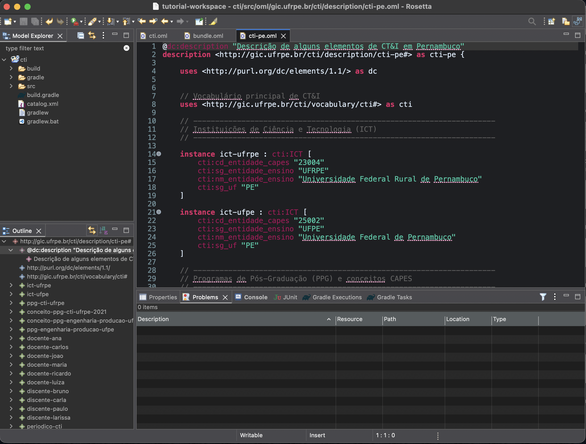

### 1.6. Editar o Description Bundle de CT&I

Agora vamos fazer com que a **description bundle** do projeto passe a usar o vocabulary bundle de CT&I e a incluir a descrição `cti-pe`. Isso define o **dataset fechado** sobre o qual o reasoner irá trabalhar.

1. Na *Model Explorer*, dê um duplo clique em `src/oml/gic.ufrpe.br/bundle.oml` para abrir o editor.
2. Substitua o conteúdo pelo código abaixo:

```oml
@dc:description "Description bundle para raciocínio fechado sobre CT&I"
description bundle <http://gic.ufrpe.br/cti/description/bundle#> as ^bundle {

	uses <http://purl.org/dc/elements/1.1/> as dc

	// O description bundle "usa" o vocabulary bundle de CT&I
	uses <http://gic.ufrpe.br/cti/vocabulary/bundle#>

	// O description bundle "inclui" a descrição CTI-PE
	includes <http://gic.ufrpe.br/cti/description/cti-pe#>

}
```

O resultado esperado no editor é ilustrado na figura a seguir:

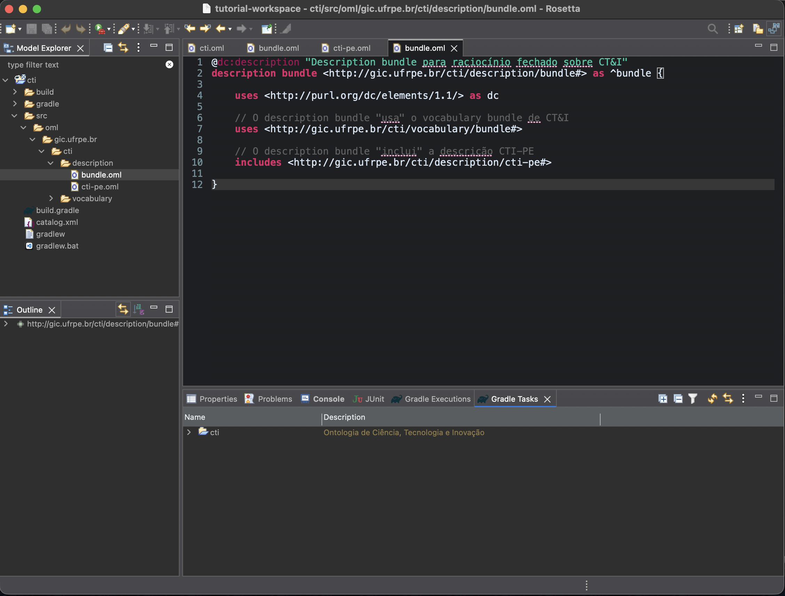

Note que o IRI do description bundle (`http://gic.ufrpe.br/cti/description/bundle#`) é consistente com a **Base IRI** e o **Bundle Namespace** configurados na criação do projeto, e com a variável `rootIri` usada no `build.gradle`.

### 1.7. Executar a tarefa de build (Gradle)

Com o vocabulary bundle e o description bundle configurados, já podemos rodar o *build* Gradle para verificar a consistência lógica do dataset CTI.

1. Abra a *Gradle Tasks view* no Rosetta (caso ainda não esteja visível, veja a subseção de interface no início do material de preparação).
2. Aguarde até que o projeto `cti` apareça na lista de tarefas Gradle.

A figura abaixo mostra onde localizar as tarefas Gradle do projeto:

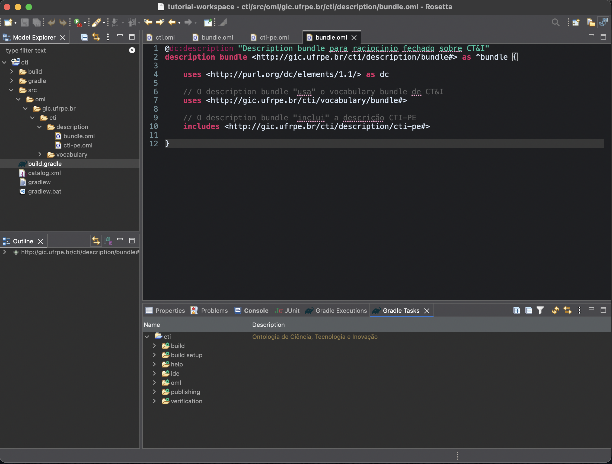

3. Na árvore de tarefas, expanda o nó `cti` e depois o nó `build`.
4. Dê um duplo clique na tarefa `build` (ela aparecerá como `cti/build/build` na *Gradle Tasks view*) e acompanhe a execução na *Gradle Executions view*.

O vídeo a seguir demonstra a execução da tarefa de build para esse projeto CTI:

<video src="videos/18-run-build-task.mov" controls width="640"></video>

Baixar vídeo: [18-run-build-task.mov](videos/18-run-build-task.mov)

Se tudo estiver correto na modelagem, o *build* deve terminar com sucesso (ícones verdes) e o reasoner não deverá reportar inconsistências para o dataset CTI. A figura abaixo ilustra um *build* bem-sucedido:

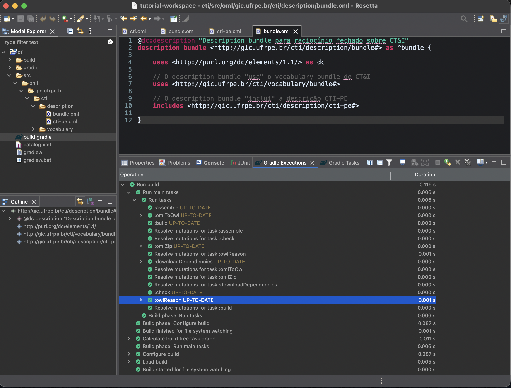

### 1.8. Executar consultas SPARQL (Run Query Task)

Com o modelo consistente e o *build* do projeto `cti` passando, podemos começar a extrair valor dos dados de CT&I usando consultas **SPARQL** sobre o dataset.

Nesta seção, vamos:

1. Criar uma pasta `src/sparql` no projeto `cti`.
2. Adicionar três arquivos de consulta SPARQL.
3. Executar as tarefas Gradle `startFuseki` e `owlQuery` para carregar o dataset e rodar as consultas.
4. Inspecionar os resultados em formato JSON na pasta `build/results`.

#### 1.8.1. Criar a pasta `sparql`

1. Na *Model Explorer*, localize o projeto `cti`.
2. Expanda o projeto e clique com o botão direito na pasta `src` → **New → Folder**.
3. No campo **Folder name**, digite `sparql` e clique em **Finish**.

A primeira figura abaixo mostra a caixa de diálogo de criação da nova pasta `src/sparql` no assistente **New Folder**:

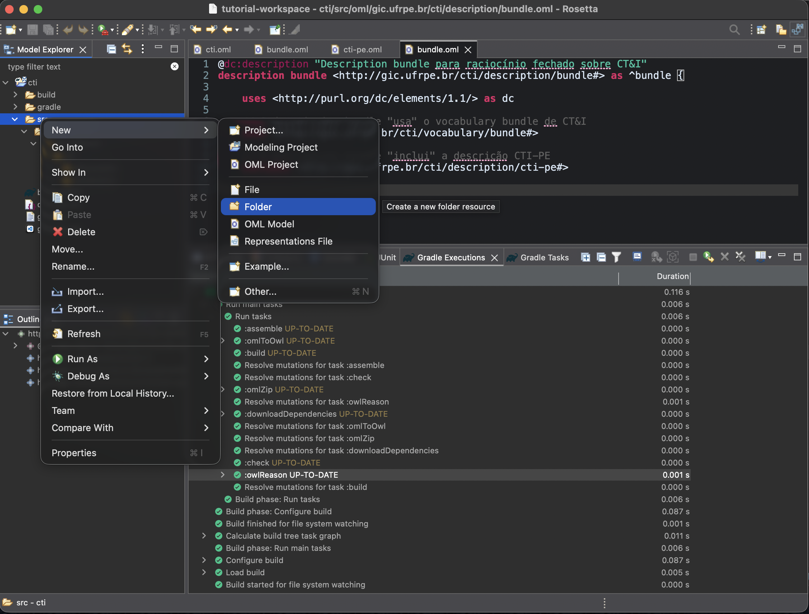

Já a segunda figura mostra a pasta `src/sparql` criada e visível na *Model Explorer*:

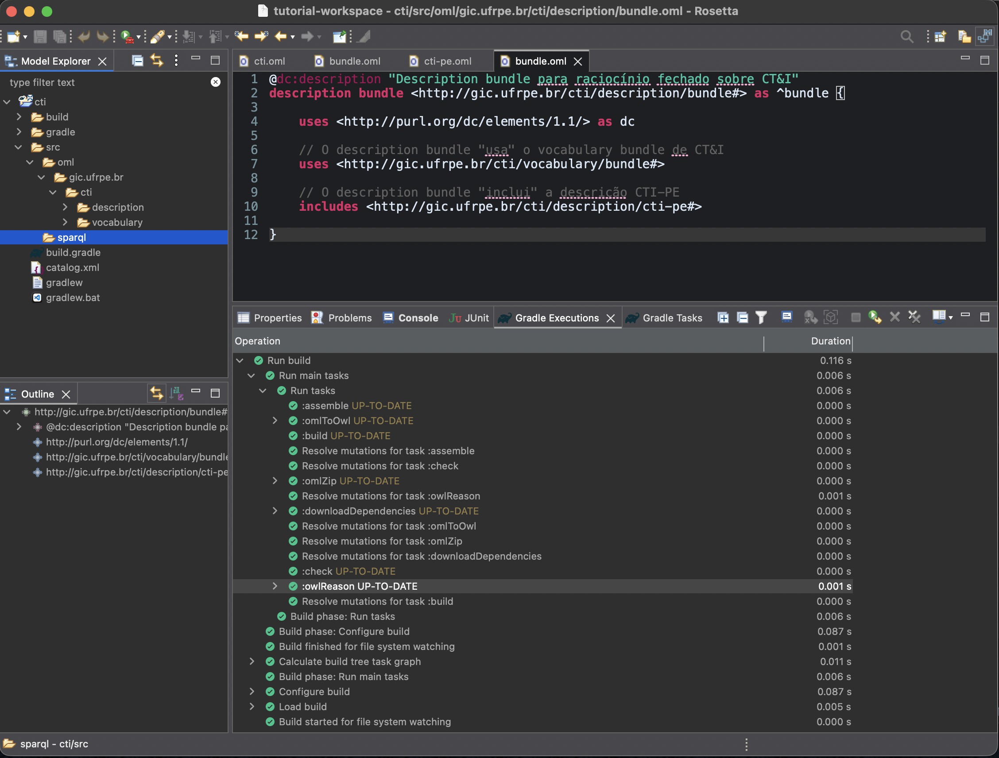

#### 1.8.2. Criar consultas SPARQL para CT&I

Vamos criar três consultas SPARQL simples, agora no domínio de CT&I:

- **Consulta 1 – PPGs e seus conceitos CAPES**
- **Consulta 2 – Docentes por PPG e ICT**
- **Consulta 3 – Produções científicas por ano e veículo de publicação**

Essas consultas serão executadas sobre o dataset gerado a partir do vocabulary `cti.oml`, da description `cti-pe.oml` e do description bundle `bundle.oml`.

##### Consulta 1 – PPGs e seus conceitos CAPES

1. Na *Model Explorer*, clique com o botão direito em `src/sparql` → **New → File**.
2. No campo **File name**, digite `PpgsAndConcepts.sparql` e clique em **Finish**.

A tela de criação do arquivo de consulta deve ser semelhante à figura abaixo:

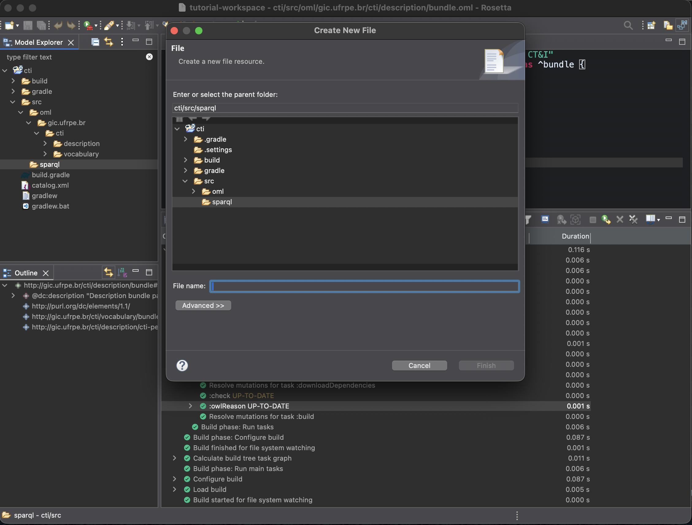

3. No editor que abrir, cole o seguinte conteúdo e salve o arquivo:

```sparql
PREFIX cti:  <http://gic.ufrpe.br/cti/vocabulary/cti#>

SELECT ?ppg ?codigo ?nome ?conceito ?ano
WHERE {
	?ppg a cti:PPG ;
		cti:cd_programa_ies ?codigo ;
		cti:nm_programa_ies ?nome ;
		cti:avaliado ?conceitoInd .

	?conceitoInd cti:cd_conceito_programa ?conceito ;
				 cti:an_base_conceito ?ano .
}
ORDER BY ?codigo
```

Essa consulta lista os PPGs do dataset, com seu código CAPES, nome e conceito (nota) da CAPES no ano base correspondente.

##### Consulta 2 – Docentes por PPG e ICT

1. Repita o processo em `src/sparql` para criar um novo arquivo chamado `DocentesPorPpg.sparql`.
2. Cole o conteúdo abaixo e salve:

```sparql
PREFIX cti:  <http://gic.ufrpe.br/cti/vocabulary/cti#>

SELECT ?siglaIct ?ppgNome ?docente ?docenteNome
WHERE {
	?ppg a cti:PPG ;
		 cti:nm_programa_ies ?ppgNome ;
		 cti:sediado ?ict .

	?ict cti:sg_entidade_ensino ?siglaIct .

	?docente a cti:Docente ;
			 cti:membro ?ppg ;
			 cti:nm_pessoa ?docenteNome .
}
ORDER BY ?siglaIct ?ppgNome ?docenteNome
```

Essa consulta retorna, para cada PPG e sua ICT (sigla da instituição), a lista de docentes vinculados.

##### Consulta 3 – Produções científicas por ano e veículo

1. Crie um terceiro arquivo em `src/sparql` chamado `ProducoesPorAnoEVeiculo.sparql`.
2. Cole o conteúdo abaixo e salve:

```sparql
PREFIX cti:  <http://gic.ufrpe.br/cti/vocabulary/cti#>

SELECT ?ano ?veiculo ?titulo
WHERE {
	?artigo a cti:Producao_Cientifica ;
			cti:an_base_producao ?ano ;
			cti:nm_titulo ?titulo ;
			cti:publicada ?veiculoInd .

	?veiculoInd cti:nm_veiculo_publicacao ?veiculo .
}
ORDER BY ?ano ?veiculo ?titulo
```

Essa consulta lista as produções científicas do dataset, agrupando por ano base e nome do veículo de publicação.

Depois de criar os três arquivos `.sparql`, a pasta `src/sparql` deve se parecer com a figura abaixo:

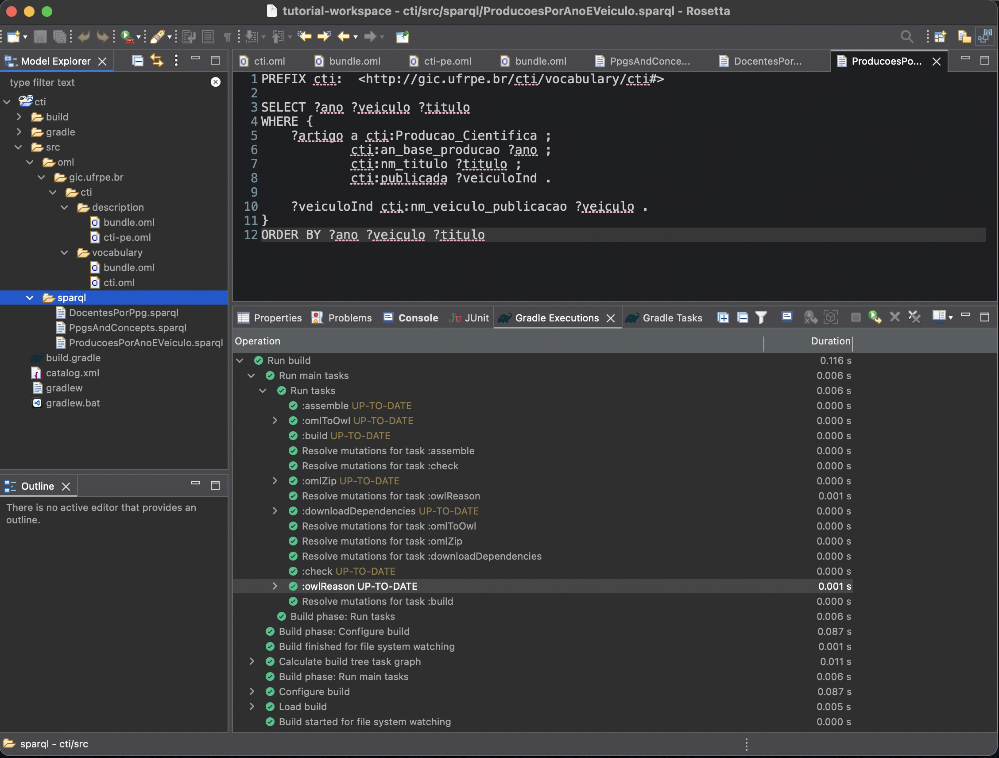

#### 1.8.3. Executar as consultas com `startFuseki` e `owlQuery`

Para executar as consultas, vamos usar as tarefas Gradle configuradas em `build.gradle`:

- `startFuseki` – inicia um servidor Apache Fuseki local, usando a configuração `.fuseki.ttl`.
- `owlQuery` – carrega o dataset CTI no Fuseki e executa todas as consultas de `src/sparql`, gravando os resultados em `build/results`.

1. Abra a **Gradle Tasks view**.
2. Expanda o nó `cti` e, em seguida, o nó `oml`.
3. Dê um duplo clique em `startFuseki` e aguarde a conclusão da tarefa na **Gradle Executions view**.
   - Após esse passo, um servidor Fuseki estará rodando localmente (por padrão, em `http://localhost:3030/cti`).
4. Ainda em `cti → oml`, dê um duplo clique em `owlQuery` e aguarde a conclusão.
   - Essa tarefa primeiro garante que o dataset CTI (ontologia em OWL) esteja carregado no Fuseki e, em seguida, executa todas as consultas da pasta `src/sparql`, gravando os resultados em `build/results` em formato JSON.

O vídeo a seguir ilustra a execução das consultas SPARQL e a inspeção dos resultados:

<video src="videos/23-show-Query-result.mov" controls width="640"></video>

Baixar vídeo: [23-show-Query-result.mov](videos/23-show-Query-result.mov)

#### 1.8.4. Inspecionar os resultados em JSON

1. Na *Model Explorer*, clique com o botão direito no projeto `cti` e escolha **Refresh**.
2. Navegue até a pasta `build/results`.
3. Você deve ver arquivos JSON com nomes correspondentes às consultas criadas, por exemplo:
   - `PpgsAndConcepts.json`
   - `DocentesPorPpg.json`
   - `ProducoesPorAnoEVeiculo.json`
4. Dê um duplo clique em `PpgsAndConcepts.json` para abrir o editor JSON.

A figura abaixo mostra um exemplo de visualização dos resultados de consulta em JSON para o tutorial de CT&I:

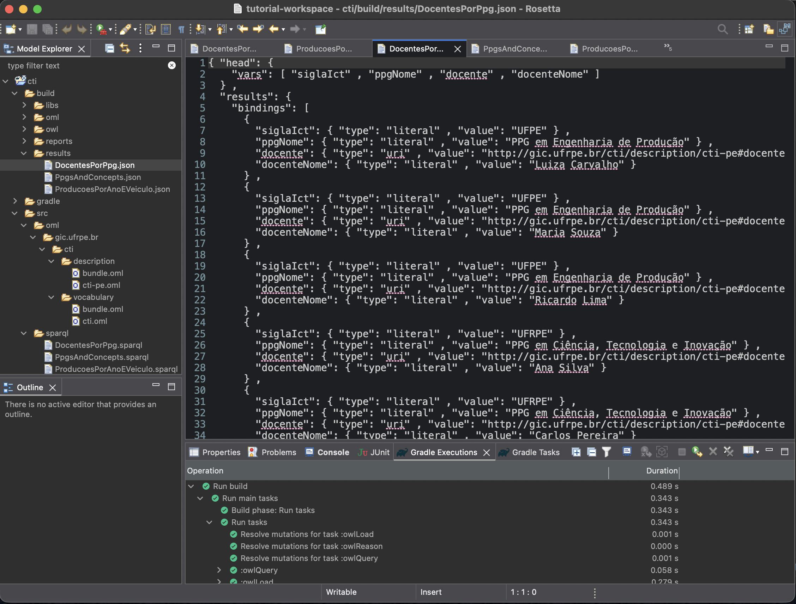

A partir desses resultados, você pode inspecionar os outros arquivos JSON para responder perguntas como:

- Quais PPGs de CT&I e Engenharia de Produção existem no dataset, com quais conceitos CAPES e anos base?
- Quais docentes estão associados a cada PPG e a qual ICT eles pertencem?
- Quantas produções científicas foram publicadas em cada ano e em quais veículos?

Quando terminar de explorar as consultas, você pode interromper o servidor Fuseki executando, na **Gradle Tasks view**, a tarefa `stopFuseki` em `cti → oml → stopFuseki` e aguardando sua conclusão na **Gradle Executions view**.

Com isso, encerramos o fluxo básico de consultas: criamos um modelo OML para CT&I, validamos sua consistência, carregamos o dataset em um servidor SPARQL (Fuseki) e executamos consultas que respondem a perguntas de negócio sobre programas de pós-graduação, instituições, docentes e produções científicas.

---

[← Voltar ao índice](../README.md#índice)
