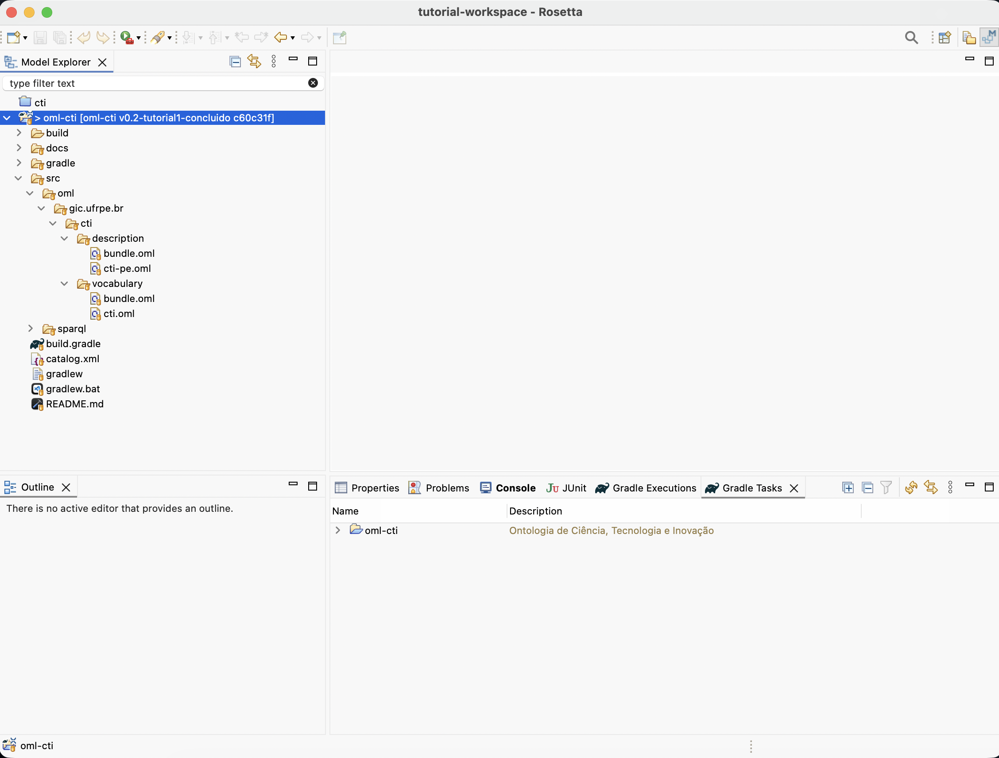
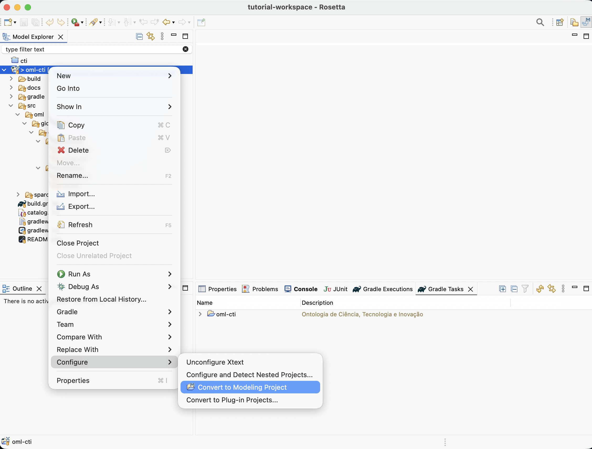
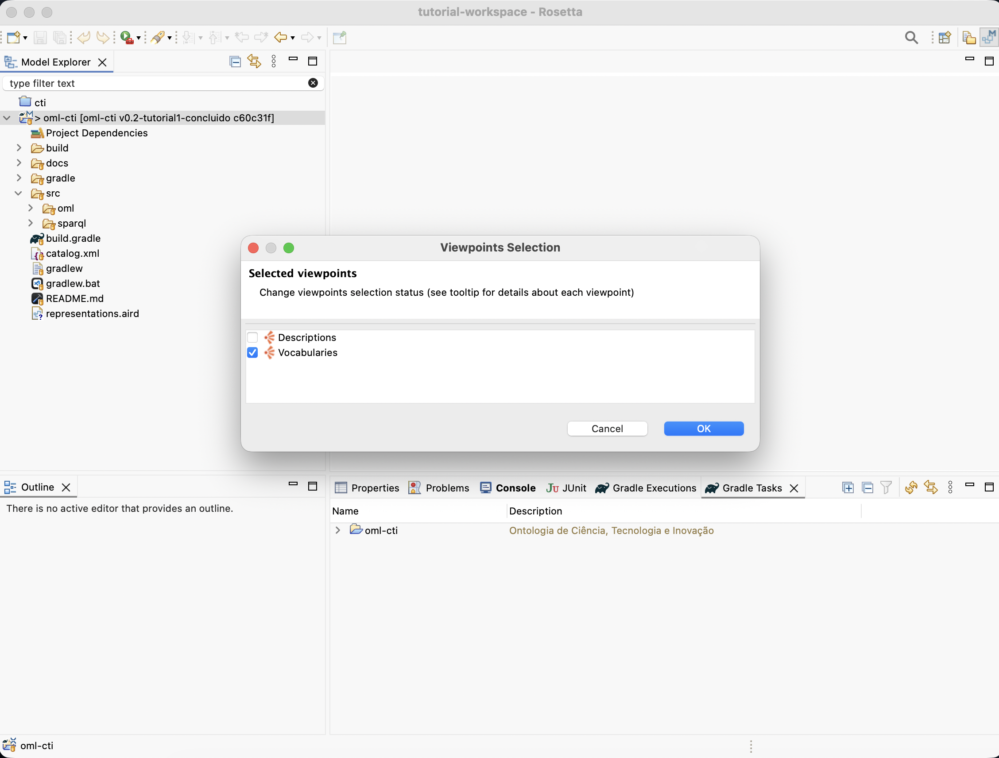
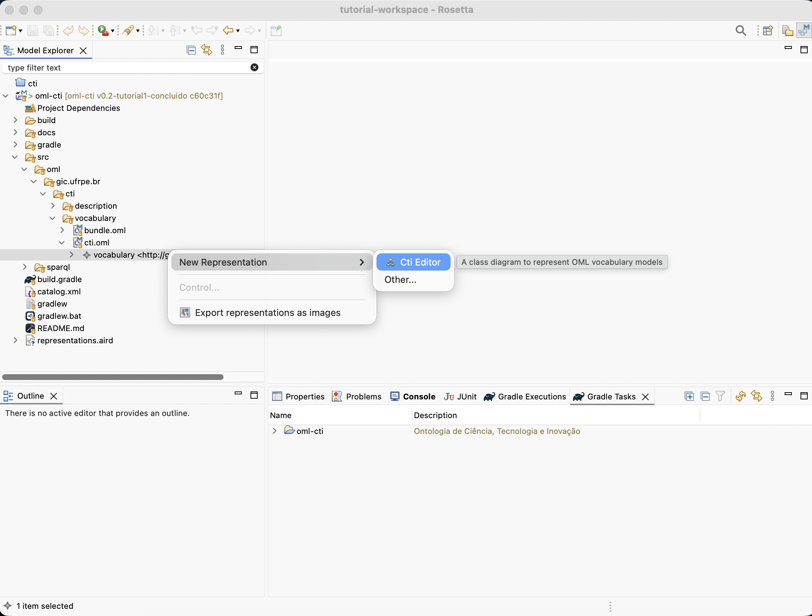
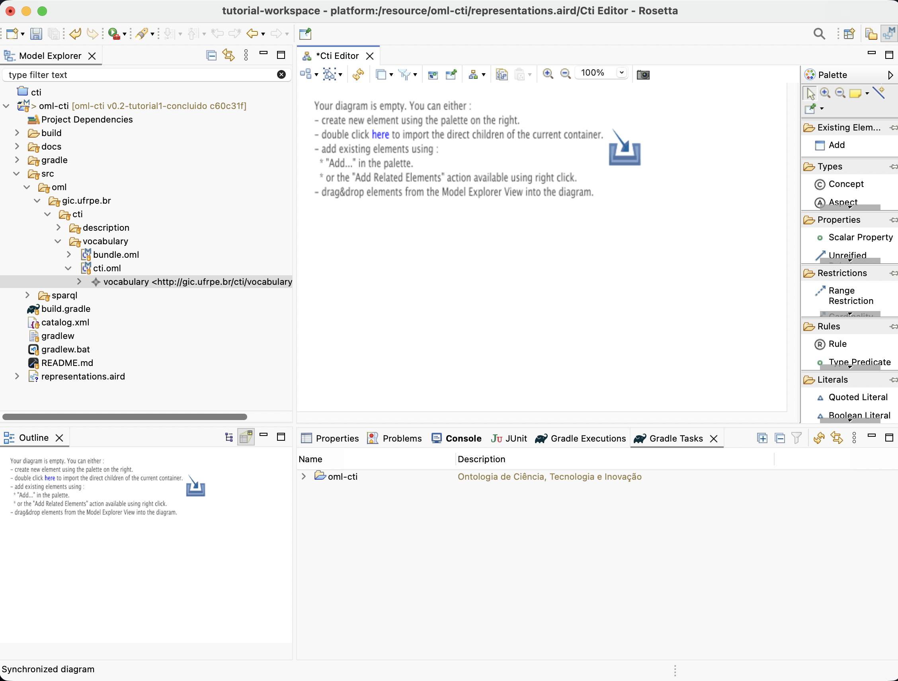
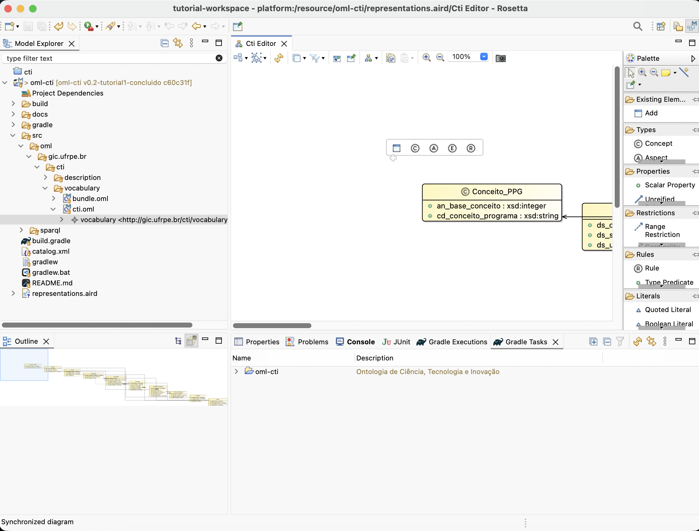
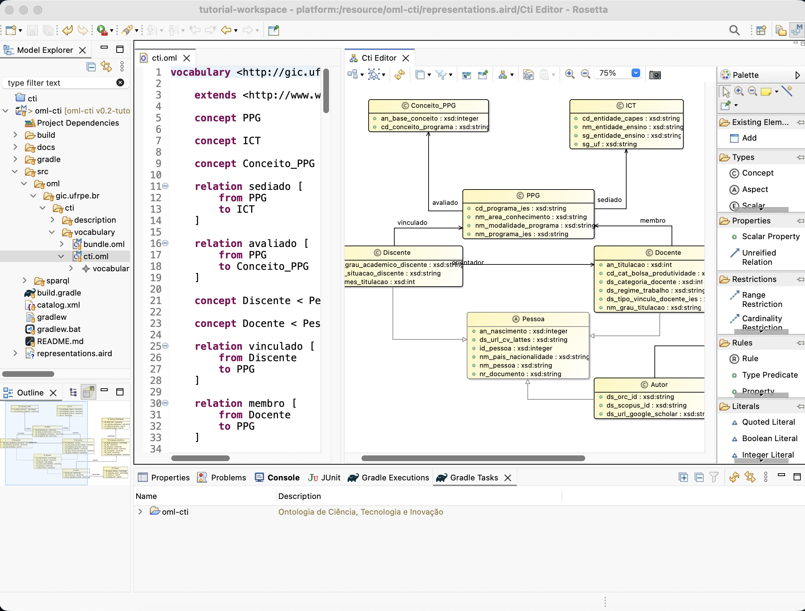
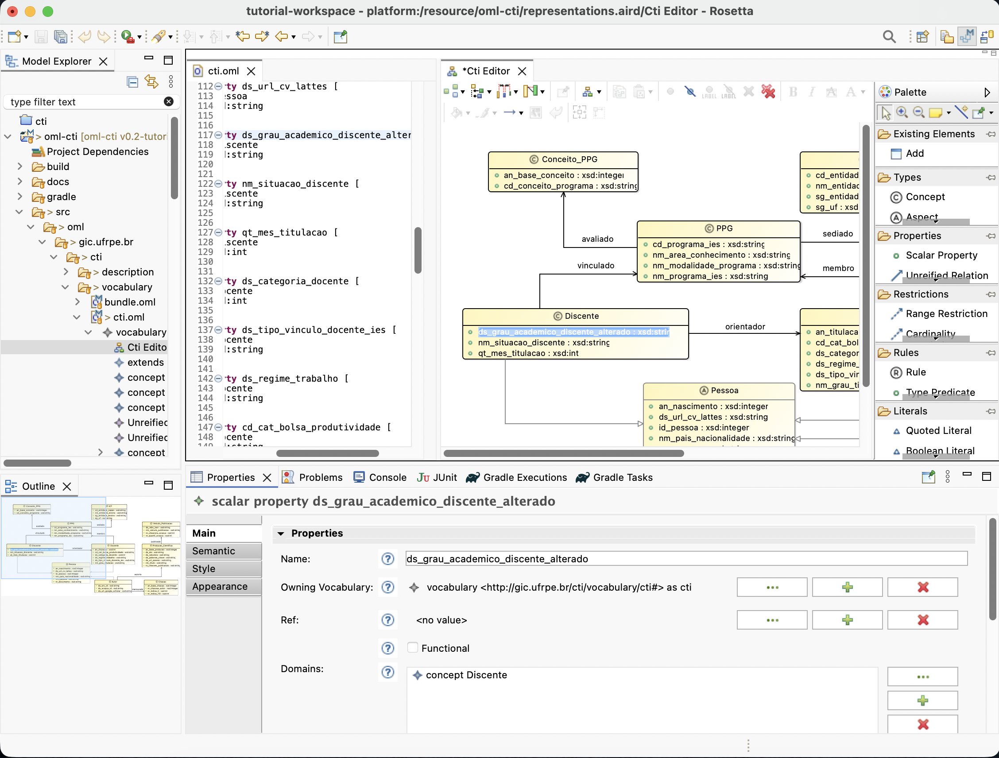
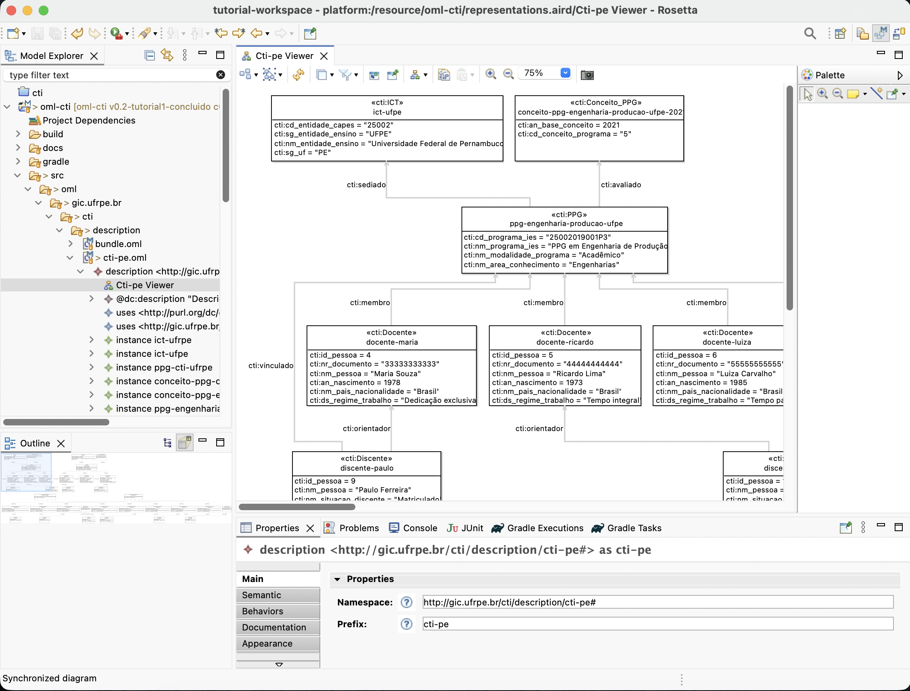

[← Voltar ao índice](../README.md#índice)

# Tutorial 2 – Modelagem gráfica com Sirius (CTI)

> Este tutorial supõe que você já concluiu o **Tutorial 1 – OML Basics (CTI)** em [docs/tutorial1-cti.md](tutorial1-cti.md) **e** que está trabalhando sobre o estado do repositório na tag **`v0.2-tutorial1-concluido`**. A partir desse modelo textual existente, vamos habilitar a modelagem **gráfica** usando Sirius no OML Rosetta.

- Projeto de referência: `cti` (este repositório)
- Foco: editar o vocabulário `cti.oml` usando diagramas Sirius, mantendo tudo sincronizado com o texto

---

## 2.1. Objetivos de aprendizagem

Ao final deste tutorial, você será capaz de:

- Converter o projeto OML de CT&I em um **Modeling Project** compatível com Sirius.
- Ativar o **viewpoint de vocabulários** ("Vocabularies") para o projeto `cti`.
- Criar um **diagrama de vocabulário** para o modelo `cti.oml`.
- Navegar entre o editor textual e o editor gráfico, observando a **sincronização automática**.
- Fazer pequenas alterações na modelagem **a partir do diagrama** e ver o resultado no arquivo OML.

Ao longo das seções, são indicados pontos sugeridos para capturar **prints de tela**.

---

## 2.2. Pré‑requisitos

Antes de começar, certifique-se de que:

1. Você já tem o workspace configurado e o projeto `cti` importado no Rosetta, conforme [docs/preparacao.md](preparacao.md).
2. Você está com o código na tag **`v0.2-tutorial1-concluido`**, que representa o estado final do Tutorial 1 (modelo CTI completo, sem diagramas Sirius ainda). Exemplos de comando no terminal:
   - `git fetch --all`
   - `git checkout v0.2-tutorial1-concluido`
3. O projeto `cti` já contém o vocabulário `cti.oml` e o description `cti-pe.oml`, conforme construído no Tutorial 1.
4. Você está na **Modeling Perspective** do Rosetta, com a view **Model Explorer** visível.

---

## 2.3. Converter o projeto em "Modeling Project"

Para que o Sirius consiga gerenciar diagramas no projeto, ele precisa ser marcado como **Modeling Project**:

1. No **Model Explorer**, localize o projeto `cti`.
2. Clique com o botão direito sobre o projeto `cti`.
3. Escolha o menu: `Configure -> Convert to Modeling Project`.
4. Aguarde alguns segundos até o Rosetta terminar a conversão.

Se o projeto já estiver convertido (a opção não aparecer), você pode seguir para a próxima seção.

---

## 2.4. Ativar o viewpoint de vocabulários

O Rosetta já vem com viewpoints Sirius prontos para OML. Para poder criar diagramas de vocabulário:

1. No **Model Explorer**, clique com o botão direito sobre o projeto `cti`.
2. Selecione `Viewpoints Selection`.
3. Na janela que se abre, marque a opção **"Vocabularies"**.
4. Clique em **OK**.

Depois disso, o projeto `cti` passa a suportar a criação de diagramas de vocabulário.

---

## 2.5. Criar o diagrama de vocabulário para `cti`

Agora vamos criar um diagrama Sirius para visualizar e editar o vocabulário de CT&I:

1. No **Model Explorer**, navegue até:
   - `cti/src/oml/gic.ufrpe.br/vocabulary/cti.oml`
2. Expanda o arquivo `cti.oml` até aparecer o elemento raiz do vocabulário, chamado **`vocabulary`**.
3. Clique com o botão direito sobre o elemento raiz `vocabulary`.
4. Escolha: `New Representation -> Vocabulary Editor` (ou nome equivalente mostrado pelo Rosetta).
5. Na janela de criação do diagrama, aceite o nome sugerido (por exemplo, `cti vocabulary diagram`) e clique em **OK**.
 6. O editor de diagrama será aberto mostrando uma mensagem do tipo *"Your diagram is empty. You can either ... double click here to import the direct children of the current container"*.
 7. Dê **duplo clique em "here"** no centro do diagrama para que o Sirius importe automaticamente os elementos do vocabulário `cti` para o diagrama.

---

## 2.6. Trabalhando com editor textual e diagrama lado a lado

1. Com o arquivo `cti.oml` aberto no editor textual, arraste a aba do editor de diagrama (por exemplo, `cti vocabulary diagram`) para a direita, de modo que fique **lado a lado** com o editor textual.
2. Ajuste o tamanho das duas áreas para que ambas fiquem legíveis.

A partir de agora, qualquer alteração no texto (ao salvar) será refletida no diagrama, e vice‑versa, na medida das funcionalidades suportadas pelo editor gráfico.

---

## 2.7. Explorando o vocabulário CTI no diagrama

Use alguns minutos para **navegar graficamente** pelo vocabulário:

1. No diagrama, localize os conceitos principais do modelo CTI:
   - `PPG`, `ICT`, `Conceito_PPG`.
   - `Pessoa`, `Discente`, `Docente`, `Autor`.
   - `Producao_Cientifica`, `Veiculo_Publicacao`, `Citacao`.
2. Observe as **relações** entre esses conceitos (por exemplo, relações entre `PPG` e `ICT`, entre `Producao_Cientifica` e `Veiculo_Publicacao`, etc.).
3. Use funções de zoom, seleção e "arrastar" para organizar melhor o layout do diagrama, ou use o comando de **auto‑layout** do Sirius (o ícone de organizar/arranjar todos os elementos na barra de ferramentas do editor, cujo tooltip em inglês costuma ser algo como "Arrange All") como ponto de partida e depois ajuste manualmente.

---

## 2.8. Editando a modelagem (exemplos)

Nesta seção vamos fazer duas alterações bem simples, só para demonstrar a **sincronização nos dois sentidos**:

- alterar um texto via **diagrama** e ver a mudança em `cti.oml`;
- adicionar uma nova **propriedade** via **texto** e ver a mudança no diagrama.

### 2.8.1. Renomear uma propriedade no diagrama e conferir em `cti.oml`

1. No diagrama do vocabulário, localize um conceito que tenha **propriedades escalares** visíveis (por exemplo, `PPG`).
2. Clique no rótulo de uma propriedade simples desse conceito (por exemplo, uma propriedade de identificador ou nome) para selecioná‑la no diagrama.
3. Na view **Properties**, localize o campo **Name** dessa propriedade.
4. Altere o nome da propriedade para uma variação simples (por exemplo, acrescente um sufixo como `PPG` ao fim do nome), sem mudar o seu tipo ou domínio.
5. Salve o diagrama (Ctrl+S ou equivalente).
6. Volte ao editor textual de `cti.oml` e localize a definição dessa mesma propriedade; confira que o **nome foi atualizado** no código OML.

### 2.8.2. Sugestão: fazer o caminho inverso com cuidado

Como exercício adicional, peça aos alunos que façam o contrário:

1. Escolher uma propriedade em `cti.oml`.
2. Renomeá‑la **diretamente no texto** (mantendo o mesmo domínio e tipo).
3. Salvar o arquivo e atualizar/reabrir o diagrama para ver o novo nome refletido graficamente.

> Observação importante: ao renomear propriedades **no texto** do vocabulário, o Rosetta **não atualiza automaticamente** os usos correspondentes em descriptions (como `cti-pe.oml`). Se existir alguma instância que use a propriedade antiga, será necessário **corrigir manualmente o description**; caso contrário, o projeto poderá exibir erros até que todos os usos sejam atualizados.

> Para ver exemplos mais avançados de edição gráfica (criação de conceitos, relações, viewpoints personalizados, ferramentas de criação/remoção etc.), consulte o **Tutorial 5 – OML Sirius** na documentação oficial: https://www.opencaesar.io/oml-tutorials/?authuser=0#tutorial5.

---

## 2.9. Visualizando a description CTI‑PE com um diagrama

Se você quiser mostrar rapidamente as **instâncias** do modelo (description `cti-pe.oml`) em forma gráfica:

1. Certifique‑se de que, em `Viewpoints Selection`, o viewpoint **"Descriptions"** também está habilitado para o projeto `cti`.
2. No **Model Explorer**, navegue até:
   - `cti/src/oml/gic.ufrpe.br/description/cti-pe.oml`
3. Expanda o arquivo até ver o elemento raiz da description.
4. Clique com o botão direito sobre esse elemento e escolha `New Representation -> Description Viewer` (ou nome equivalente mostrado pelo Rosetta).
5. Ajuste o layout do diagrama para visualizar algumas instâncias relevantes (por exemplo, um `PPG` específico, sua `ICT` associada e algumas `Producao_Cientifica`).

Neste tutorial, o foco principal é o **vocabulário**, então esta etapa é opcional e pode ser usada apenas como demonstração rápida.

---

## 2.10. Resumo

Neste segundo tutorial, você:

- Configurou o projeto `cti` como **Modeling Project** compatível com Sirius.
- Ativou o viewpoint de **Vocabularies** para poder criar diagramas de vocabulário.
- Criou um diagrama Sirius para o vocabulário `cti.oml`.
- Viu na prática a **sincronização** entre o editor textual e o editor gráfico.
- Realizou pequenas edições no modelo diretamente pelo diagrama, observando o efeito no código OML.

---

[← Voltar ao índice](../README.md#índice)